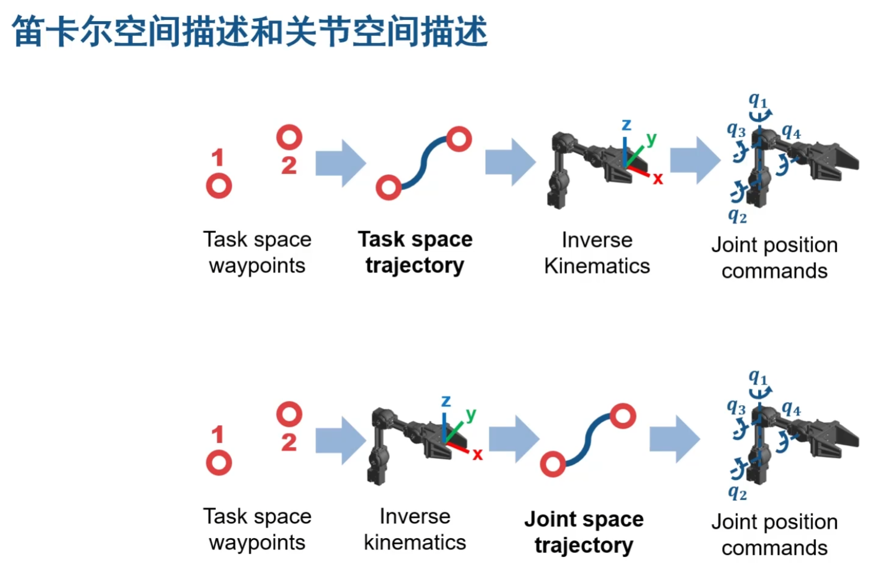

# 机械臂学习

## 机械臂应用

## 机械臂工作流

## 机械臂的表示方法

==URDF 只支持树状的模型==
Matlab 不支持部分 URDF 扩展的元素和组件

## 联合仿真

## 机械臂运动学和动力学

**运动学（Kinematics）：只考虑几何属性**
**动力学（Dynamics）：由力引起的运动，考虑质量，惯性**

## 任务规划

## 运动规划

==笛卡尔空间（task space）：先确定轨迹中的每一个点，再逆运动学规划，一般有大量的运算==
==关节空间（joint space）：只确定轨迹的起点和终点，对中间的位置不可预测，比较简便==

## 部署

